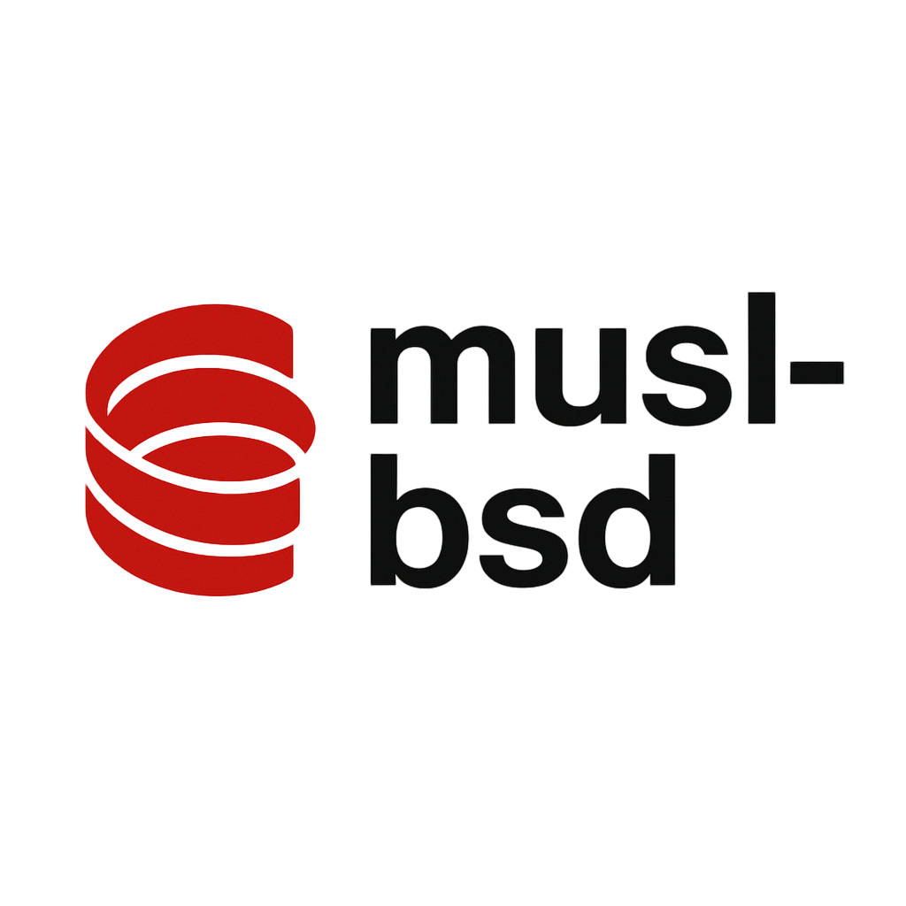

<div style="background-color: #1e1e1e; padding: 1em; display: inline-block; border-radius: 8px;">
  
</div>


**musl-bsd** is a portability layer that restores familiar BSD/GNU userland APIs on top of [musl libc](https://musl.libc.org/). It provides drop-in libraries (`libfts`, `libobstack`) and headers (`queue.h`, `tree.h`, `cdefs.h`, `obstack.h`, `fts.h`) that closely track the original NetBSD/OpenBSD and GNU implementations while compiling cleanly in a modern C99 toolchain. The project is aimed at packagers, embedded integrators, and maintainers carrying legacy Unix codebases into musl-based environments without rewriting platform-specific glue.

---

## System Architecture

- **Library split**
  - `libfts`: NetBSD-derived file tree traversal with full support for `FTS_*` flags, multibyte-safe path handling, and leaf re-rooting semantics. `FTSENT` layout and flag bits are preserved byte-for-byte to remain ABI-compatible with BSD consumers.
  - `libobstack`: GNU obstack allocator with both standard and "extra" allocator hooks enabled via `_obstack_begin_worker()` and `_obstack_newchunk()`, mirroring glibc so stack-allocated growth descriptors work unchanged.
- **Header exports**
  - `queue.h`, `tree.h`: Macro-based intrusive container templates. Each macro has been audited to avoid GCC extensions, making them usable under `-std=c99 -pedantic`.
  - `cdefs.h`: Compiler feature detection, `_Noreturn`, visibility, `_Static_assert`, and compatibility macros shared by `<sys/cdefs.h>` consumers. Defaults match NetBSD and gate optional attributes with feature probes.
- **Source layout**
  - `src/fts.c`, `include/fts.h`
  - `src/obstack.c`, `include/obstack.h`
  - `src/argp/`: glibc-compatible argp clone (headers under `include/argp/`)
  - `tests/`: standalone C tests mirroring the exported feature set.

---

## Feature Details

- **FTS traversal**
  - Implements `fts_open`, `fts_read`, `fts_children`, `fts_set`, and `fts_close`.
  - Supports symlink following (`FTS_LOGICAL`), physical walks (`FTS_PHYSICAL`), comparison callbacks, `FTS_WHITEOUT`, and deep directory cycles guarded by hash-based dev/inode detection.
  - Path stacking uses musl-safe `PATH_MAX` fallbacks and internal in-place name buffers; no glibc-specific readdir optimisations are required.
- **Obstack allocator**
  - Provides the GNU obstack API including chunk growth, `obstack_printf`, and the `obstack_alloc_failed_handler`.
  - Reuses musl's `malloc`/`realloc` underneath but accepts caller-supplied allocators for embedded systems with custom arenas.
- **argp compatibility**
  - The argp port mirrors glibc's `argp_parse`, `argp_state`, and `option` semantics, enabling direct reuse of existing argp-based CLIs.
  - Error and help formatting follow glibc's defaults so translated strings and `ARGP_HELP_FMT` tunables behave identically.

---

## Build & Configuration

Builds are driven by **Meson** (defaults: `clang`, `clang++`, `ld.lld`):

```sh
meson setup build --prefix=/usr          # configure (pass -Dbuildtype=debugoptimized for releases)
meson compile -C build                   # build libraries and tests
meson install -C build                   # install into prefix (run under sudo if needed)
```

Useful Meson options:

- `-Ddefault_library=shared|static` to control linkage style.
- `-Db_coverage=true` to enable gcov/lcov instrumentation (`ninja -C build coverage` after running tests).
- `-Dwarn_level=2` enforced by the project to keep warnings fatal; additional flags can be supplied via `CFLAGS`/`LDFLAGS`.

The `build/` directory contains all generated artefacts; re-run `meson setup` when changing toolchains to refresh the cache.

---

## Testing & Validation

- Unit and behavioural tests live under `tests/`. FTS coverage is split into per-scenario files under `tests/fts/`, with obstack and argp covered by `tests/test_obstack.c` and `tests/test_argp*.c`.
- Execute the suite with:

  ```sh
  STRICT=1 meson test -C build --print-errorlogs
  ```

  `STRICT=1` promotes traversal warnings to test failures so regressions in loop bounds or error propagation are caught early.
- Coverage reports are produced via:

  ```sh
  meson configure build -Db_coverage=true
  meson test -C build
  ninja -C build coverage
  ```

  Reports end up under `build/meson-logs/coveragereport/`.

---

## Integration Guidelines

- Link flags: `-lfts -lobstack` (argp can be linked by adding `-largp` once enabled in `meson.build`).
- Headers install into `/usr/include` (or `${prefix}/include`), matching upstream names so existing build scripts that probe for `<fts.h>` or `<obstack.h>` continue to work.
- Cross-compilation: supply a Meson cross file. Only `malloc`, `realloc`, `free`, `getcwd`, `open`, `fstatat`, `readlink`, and standard POSIX directory calls are required from the C library, keeping the dependency footprint minimal.
- ABI stability: `FTSENT` retains NetBSD's layout; avoid toggling struct members or padding without bumping SONAMEs. Obstack exports match glibc symbol versions where applicable, making binaries interchangeable with glibc-provided `libobstack`.

---

## Compatibility Notes

- Verified on musl-based distributions (Alpine, Void, postmarketOS). The code paths also compile on glibc for comparison, but the primary target remains musl.
- Requires only POSIX.1-2008 APIs; no glibc-only extensions are used. Optional features are gated behind `#ifdef`s and compiler checks in `include/cdefs.h`.
- When porting to constrained systems, consider providing custom allocators for obstacks to prevent fragmentation in tiny heaps.

---

## Directory Overview

- `include/` – Public headers installed verbatim; maintainers should treat breaking changes as ABI-affecting.
- `src/` – Library sources; `fts.c`, `obstack.c`, and argp sources live here to mirror upstream layouts.
- `tests/` – Portable regression tests; add new scenarios with deterministic fixtures.
- `build/` – Generated Meson artifacts (safe to delete when reconfiguring).

---

## Licensing

- `fts.*`: BSD 2-Clause
- `obstack.*`: GNU LGPL 2.1+
- `queue.h`, `tree.h`, `cdefs.h`: BSD-derived terms
- `src/argp/*`: LGPL-2.1+ / GPL-2.0+ matching glibc's dual-licence

Each file headers its own licence; observe them when redistributing.

---

## Contributing

Contributions are welcome. When submitting patches, please:

1. Keep the code C99-compliant and warning-free under `-Wall -Wextra -Werror`.
2. Maintain portability to musl and other non-glibc targets; reuse helpers inside `fts.c` rather than introducing libc-specific shortcuts.
3. Update `meson.build` and relevant tests when moving or adding sources.
4. Document user-visible changes (new headers, Meson options) in commit messages following the `area: imperative summary` style.

Discussions for major features or ABI changes can be started via issues or mailing list threads so downstreams remain informed.
