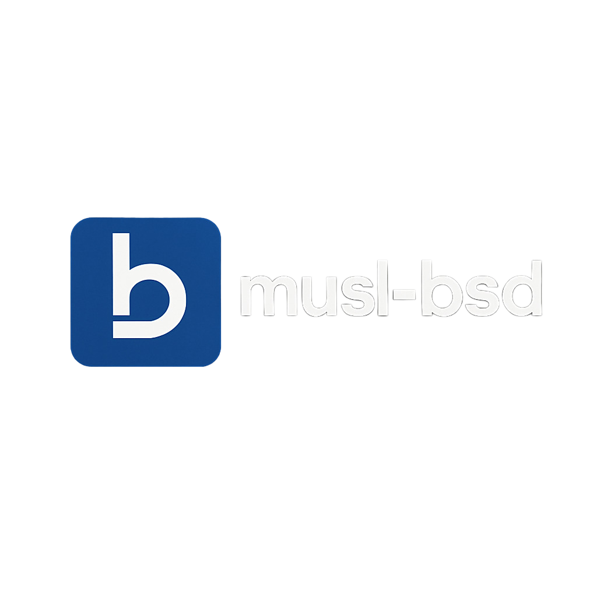

# musl-bsd


**musl-bsd** is a lightweight compatibility library that provides BSD-style functionality and macros for systems using [musl libc](https://musl.libc.org/). It includes portable implementations of common BSD APIs such as `fts(3)` and `obstack(3)`, along with supporting headers like `queue.h`, `tree.h`, and `cdefs.h`.

This project is useful when porting BSD-licensed software or building legacy Unix code on Linux systems using musl.

---

## Features

- 🗂️ **`fts(3)`**: Directory traversal API (`fts_open`, `fts_read`, etc.).
- 📦 **`obstack(3)`**: Efficient stack-based memory allocation.
- 🧩 **`queue.h`, `tree.h`**: BSD-style macros for linked lists, tail queues, and binary trees.
- 🧠 **`cdefs.h`**: Standard macro definitions for compiler features and visibility.

---

## Installation

### Using Meson

```sh
meson setup build --prefix=/usr
meson compile -C build
sudo meson install -C build
```

This will install:
- `libfts.so`, `libobstack.so` → `/usr/lib/`
- `fts.h`, `obstack.h`, `queue.h`, `tree.h`, `cdefs.h` → `/usr/include/`

---

## Usage

To link against the provided libraries:

```c
#include <fts.h>
#include <obstack.h>
#include <queue.h>
#include <tree.h>
#include <cdefs.h>
```

Compile your programs with:

```sh
cc myapp.c -lfts -lobstack
```

---

## Compatibility

- Requires **GCC 13+** or **Clang 17+**
- Tested on **musl-based Linux systems**
- C99 and POSIX.1-2008 compliant

---

## License

Each component retains its original permissive license:

- `fts.c` and `fts.h`: BSD 2-Clause License
- `obstack.c`, `obstack_printf.c`, `obstack.h`: GNU LGPL (2.1+)
- `queue.h`, `tree.h`, `cdefs.h`: Derived from BSD-licensed sources

See the relevant license headers in each file for details.

---

## Credits

- [Void Linux](https://github.com/void-linux) for maintaining portable musl-based patches.
- NetBSD/OpenBSD for original queue/tree/cdefs macros.
- GNU for `obstack`.

---

## Contributions

Contributions and portability improvements welcome! Please ensure that your changes remain musl-compatible and BSD-licensed.
